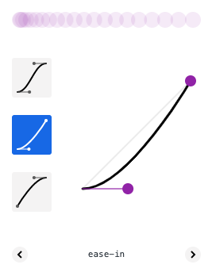
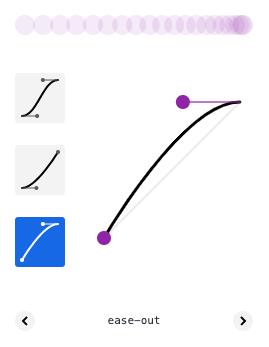
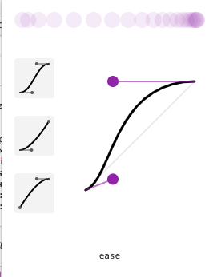
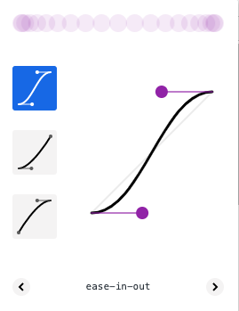

# 019

Time taken: ~15mins

Things I learnt:

* `ease` and `ease-in-out` are very different animation curves.

Ease-in:

Equates to `cubic-bezier(0.42, 0, 1.0, 1.0)`

Ease-out:

Equates to `cubic-bezier(0, 0, 0.58, 1.0)`. They aren't exactly the
reverse functions of each other.

Ease:

Ease-in-out:

`ease-in-out` is a combination of both `ease-in` and `ease-out`; it equates
to `cubic-bezier(0.42, 0, 0.58, 1.0)`.

`ease` equals `cubic-bezier(0.25, 0.1, 0.25, 1.0)` - starts off quicker,
gains velocity faster, and ends more gradually. I've read somewhere that
asymmetric easing functions simulate the real world better and look more
natural. Functions like ease-in are used for objects flying into the page;
ease-out is used for objects flying out of the page. Almost everything else
can be animated with linear, ease or ease-in-out.

